<picture>
  <source media="(prefers-color-scheme: dark)" srcset="https://raw.githubusercontent.com/cloudia-cassandra/cloudia-cassandra/main/dark.svg">
  <source media="(prefers-color-scheme: light)" srcset="https://raw.githubusercontent.com/cloudia-cassandra/cloudia-cassandra/main/light.svg">
  
</picture>

<!--
  This card is generated by generate_profile.py and refreshed daily by
  .github/workflows/profile.yml. Edit CONFIG / ASCII_ART / INFO in the script,
  never the .svg files directly.
-->

  

<picture> 
  <source media="(prefers-color-scheme: dark)" srcset="./contribution-graph-dark.svg"> 
  <source media="(prefers-color-scheme: light)" srcset="./contribution-graph-light.svg"> 
   </picture>

